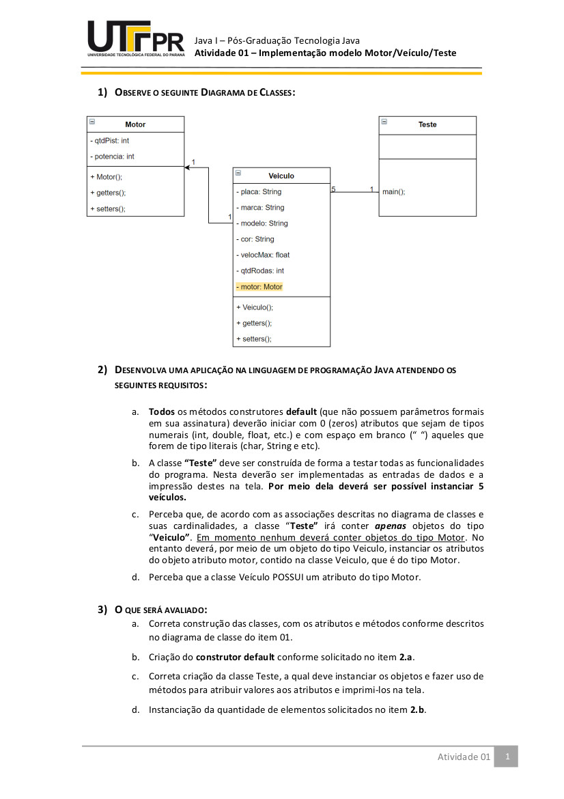
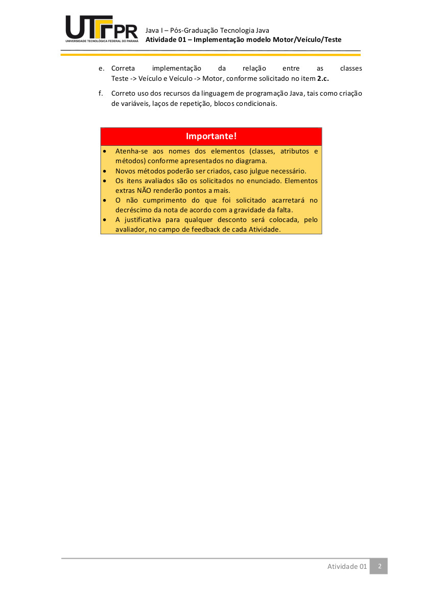

# Atividade 1

Essa atividade 1 faz parte de um conjunto de atividades da Disciplina de Linguagem de Programação Java I

O principal objetivo dessa atividade é validar o entendimento de conceitos básicos a linguagem Java, como condicionais, fluxo de execução, encapsulamento etc.

Apesar da baixa complexidade, usei essa atividade para fixar conceitos de abordagens de SOLID, a utilização de design patterns, etc, buscando treinar essas abordagens para criação de melhores códigos fontes.

Foram trabalhados nomes de atributos nas classes, relacionamento entre as classes de dominios e serviços através de interfaces, etc

Segue o enunciado da atividade a seguir:

.
.

